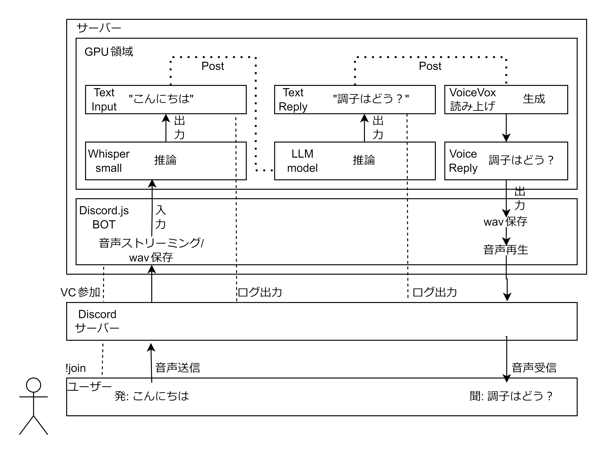

# HanaseLLM

## 概要
Discord上でのLLMとの会話(通話)  
全システムローカル動作可


### 構成図  
<picture>
  <source srcset="./pics/hanasellm-dark.png" media="(prefers-color-scheme: dark)">
  <source srcset="./pics/hanasellm-light.png" media="(prefers-color-scheme: light)">
  
</picture>

## 使い方

### 事前構築
openai-chatgpt互換のLLMサーバを localhost:5001 に  
[VOICEVOX](https://github.com/VOICEVOX/voicevox_engine)のAPIサーバを localhost:50021 に


### 起動

``` 
// whisperサーバの起動 :5000
python3 faster.py 

// 初回 パッケージインストール
npm install

// discord.js サーバ起動
node index.js
```

### Discordコマンド

- !join ボイスチャンネルに参加
- !clear 会話履歴の削除
- !history サーバ側に会話履歴表示

### 注意
プッシュトゥトークを設定する(誤検知対策)

## 改善したい
- [ ] ~~発言者の名前がすべて!join実行者の名前になっている~~
- [ ] ~~複数人の場合は人別にhistoryを分ける~~
- [ ] 一括起動のスクリプト？docker化？
- [ ]  レスポンス改善(wavエンコードを経由しないリアルタイムな手法？)
- [ ] 文字起こしのリソース削減、リアルタイム化
- [ ] llmの設定、サーバーを設定ファイルまたはdiscordから変更できるようにする